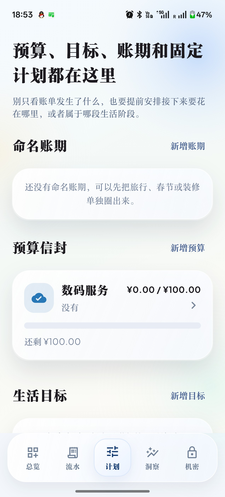

# 潮汐账本

一款面向日常生活场景的 Flutter 安卓记账应用。它把自动记账、预算目标、命名账期、洞察分析和本地加密放在同一个应用里，重点不是“做一套好看的空 UI”，而是把真实可用的记账流程做完整。

## 🎉 最强智能化大航海升级 (v2.0 AI Evolution)

本项目现已全面接入本地 AI 与离线智能辅助分析系统：
- **纯血离线 STT 录音引擎与自然语义提取 (NLP)**：支持无唤醒直接按住首页侧边悬浮浮窗收录人声（附带无缝 AI 文本兜底输入）。对着手机说“昨天在全家买水花了5块”，APP 将通过纯本地引擎秒解构出日期、商户、分类及金额，一键“零阻力”入账。
- **动态防刺客订阅雷达 (Subscription Radar)**：底层算法全局扫描长达 120 天的历史流水，自动在月底拦截暗处的自动续费、连续包月扣款，强效护眼并守护钱包。
- **天气预报级烧钱风控中心 (Burn-rate Predictor)**：根据用户近期的频次与力度模型预测预算干涸天数，“照这个造法，餐饮池将在 3 天后见怪”，让你对支出把持得一清二楚。
- **治愈系情绪消费热图 (Mood Analysis)**：引入独具情感温度的记录流。现在无论你是否激动，点上“开心/冲动/心累”，系统月底帮你具象化你的“情绪买单金额”。
- **全面重构的资金池系统 (Asset Pools)**：剥离旧有繁杂交互，采用全顺滑弹性动画（ElasticOut），支持实时编辑余额与类型映射，容错拉满。

## 现在能做什么

- 自动记账：通过系统通知读取微信、支付宝、Google Pay、淘宝、京东、拼多多、闲鱼等支付/订单提示，并尽量合并成一条主支付记录。
- 流水管理：支持搜索、筛选、编辑、删除、账期归类，以及自动识别付款人/收款方名字。
- 计划能力：支持预算信封、生活目标、固定支出计划、命名账期。
- 洞察分析：提供近六个月现金流、分类结构、生活维度热力表和关键判断。
- 隐私与安全：账本默认保存在本机，Android 侧使用标准 AES-GCM 加密，支持指纹解锁、禁止截屏、本地加密备份导入导出。

## 下载

- 最新版本：见 [Releases](https://github.com/Evelorion/chaoxi-jizhang/releases/latest)
- 当前仓库默认提供 `arm64-v8a` Android Release APK

## 页面预览

<table>
  <tr>
    <td align="center">
      
      <div><strong>总览</strong><br/>看本月净结余、生活覆盖和自动记账进展</div>
    </td>
    <td align="center">
      
      <div><strong>流水</strong><br/>搜索、筛选、编辑和追踪每一笔流水来源</div>
    </td>
  </tr>
  <tr>
    <td align="center">
      
      <div><strong>计划</strong><br/>预算、目标、账期和固定计划统一管理</div>
    </td>
    <td align="center">
      
      <div><strong>洞察</strong><br/>用结构图和现金流趋势把钱放回生活语境里看</div>
    </td>
  </tr>
</table>

## 技术栈

- Flutter 3 / Dart
- Android Kotlin 通知监听服务
- Riverpod 状态管理
- fl_chart 数据可视化
- local_auth / flutter_secure_storage 本地生物识别与安全存储

## 本地运行

```bash
flutter pub get
flutter analyze
flutter test
flutter run
```

## Android 打包

```bash
flutter build apk --release --split-per-abi
```

默认产物位置：

- `build/app/outputs/flutter-apk/app-arm64-v8a-release.apk`
- `build/app/outputs/flutter-apk/app-armeabi-v7a-release.apk`
- `build/app/outputs/flutter-apk/app-x86_64-release.apk`

## 项目结构

```text
lib/
  main.dart
  src/app.dart                  Flutter 主界面、数据模型、控制器
android/app/src/main/kotlin/
  .../MainActivity.kt          Android 原生桥接
  .../LedgerNotificationListenerService.kt
  .../NotificationParser.kt    自动记账通知解析
  .../VaultCipher.kt           Android 本地加密
test/
  ledger_book_test.dart        账本与序列化回归测试
```

## 当前重点

- 优化总览到收入/支出详情页的转场与返回性能
- 继续提升微信/支付宝转账通知的人名和方向识别
- 完善 Release 发布流程和版本说明
