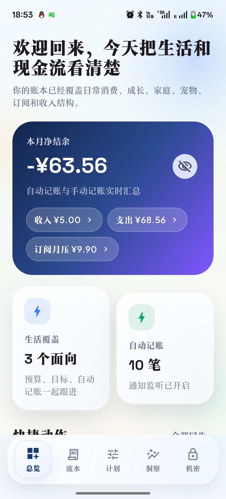
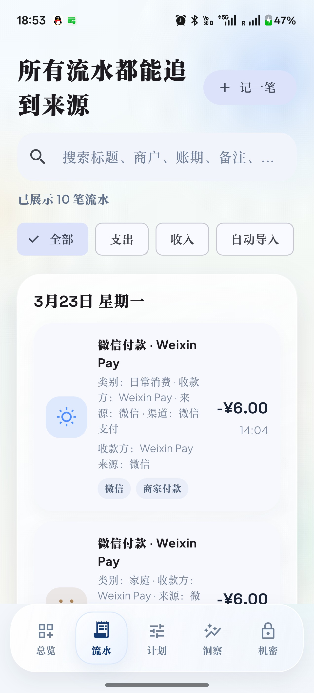
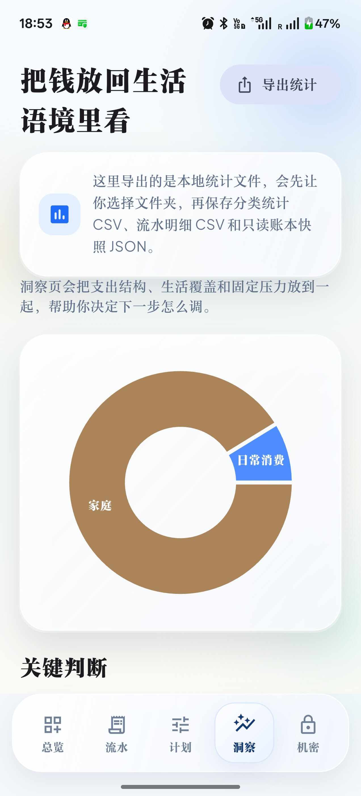

# 潮汐账本 (Chaoxi Jizhang)

> 一款为中文用户打造的智能个人记账 App，基于 Flutter 开发，支持自动记账、位置智能化、AI 分析洞察，数据本地加密存储。

<p align="center">
  <a href="https://github.com/Evelorion/chaoxi-jizhang/releases/latest">
    
  </a>
  
  
  
</p>

---

## 📥 下载安装

**[→ 点击下载最新版 APK](https://github.com/Evelorion/chaoxi-jizhang/releases/latest)**

> 下载 `app-release.apk`，安装时需在手机上允许「未知来源」应用安装。

---

## ✨ 核心功能

### 🤖 自动记账
- 监听微信、支付宝、Google Pay、京东、淘宝、拼多多、闲鱼支付通知，**自动抓取金额和商家**
- 智能合并重复通知，避免重复记录
- 可自定义各渠道的分类规则

### 📍 位置智能化（v2.1.0 新增）
- **秒级定位**：优先使用 OS 缓存位置，无需等待 GPS
- **国内可用**：使用 BigDataCloud + ip-api.com，不依赖 Nominatim，稳定返回中文地址
- **IP 辅助定位**：GPS 不可用时自动走网络定位（城市级精度）
- **自动记账记录位置**：自动记账时可选择异步附加当前位置
- **常用地点管理**：收藏高频消费地点，自动匹配模板

### 🎙️ 语音速记
- 长按麦克风按钮语音输入，支持中文自然语言解析
- 自动识别金额、分类、商家、备注

### 📊 洞察分析
- 月度收支趋势、分类占比图表
- 区域消费分布（基于定位数据）
- 订阅雷达：识别并追踪周期性支出
- 燃烧率预测：预估月底结余

### 🔐 隐私与安全
- 所有数据本地存储，**不上传任何云端**
- AES-GCM 加密落盘，机密模式支持金额遮罩
- 生物识别解锁（指纹/面容）
- 后台自动锁定

### 💰 预算与目标
- 自定义月度预算，实时进度追踪
- 设定储蓄/消费目标，可视化达成进度

### 🔄 订阅管理
- 识别月租、年费等周期性账单
- 到期提醒，避免忘记续费

---

## 🆕 v2.1.0 更新日志

### 新增功能
- **IP 辅助定位**：GPS 不可用时自动通过网络 IP 获取位置
- **自动记账定位开关**：设置 → 位置记账助手，可选是否在自动记账时记录位置
- **并行定位竞争**：GPS 和 IP 定位同时发起，谁先返回用谁，提升速度

### Bug 修复
- 修复 Nominatim 在中国大陆不可达导致的定位失败，改用 BigDataCloud
- 修复定位等待时 UI 卡顿（转圈）问题
- 修复关闭记账表单后定位回调触发的 `setState-after-dispose` 崩溃
- 修复 Release APK 因缺少签名配置无法构建的问题

[查看完整 Release Notes →](https://github.com/Evelorion/chaoxi-jizhang/releases/tag/v2.1.0)

---

## 🏗️ 技术栈

| 层级 | 技术 |
|------|------|
| UI 框架 | Flutter 3 / Dart |
| 状态管理 | Riverpod |
| Android 原生 | Kotlin（通知监听服务） |
| 图表 | fl_chart |
| 定位 | geolocator + BigDataCloud + ip-api.com |
| 加密 | AES-GCM（Android Keystore） |
| 生物识别 | local_auth |
| 存储 | flutter_secure_storage |

---

## 📂 项目结构

```
lib/
  main.dart
  src/
    app.dart                    核心控制器 & 全部 UI
    location_helper.dart        位置获取、反向地理编码
    ui_location_map.dart        消费地图可视化
    ui_voice_fab.dart           语音速记浮动按钮
android/app/src/main/kotlin/
  .../MainActivity.kt
  .../LedgerNotificationListenerService.kt   通知监听
  .../NotificationParser.kt                  金额解析
  .../VaultCipher.kt                         加密层
test/
  ledger_book_test.dart         单元测试
```

---

## 🔧 本地开发

```bash
# 安装依赖
flutter pub get

# 代码检查
flutter analyze

# 运行测试
flutter test

# 调试运行
flutter run

# 打包 Release APK
flutter build apk --release
```

> **注意**：如需正式签名，将 `key.properties` 放置于 `android/` 目录，否则自动使用 debug 签名构建。

---

## 📸 应用截图

<table>
  <tr>
    <td align="center">
      
      <div><strong>首页</strong><br/>收支汇总 · 快速记账</div>
    </td>
    <td align="center">
      
      <div><strong>流水</strong><br/>筛选 · 自动记账 · 来源追溯</div>
    </td>
    <td align="center">
      
      <div><strong>洞察</strong><br/>图表 · 区域分布 · 预测</div>
    </td>
  </tr>
</table>

---

## 📄 许可证

本项目仅供个人学习与使用，暂未开放商业授权。

---

<p align="center">
  <strong>潮汐账本</strong> · 让记账像潮水一样自然
</p>
