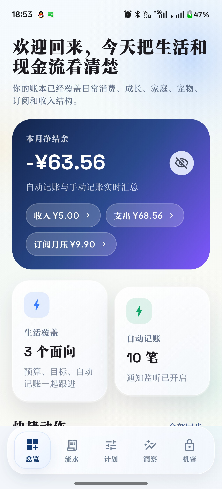
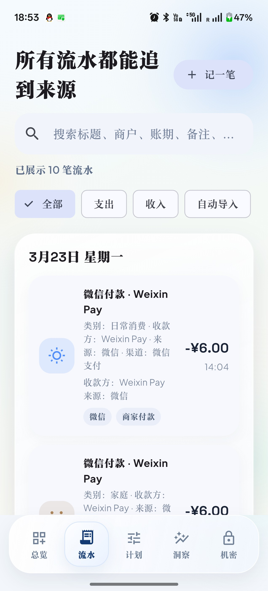
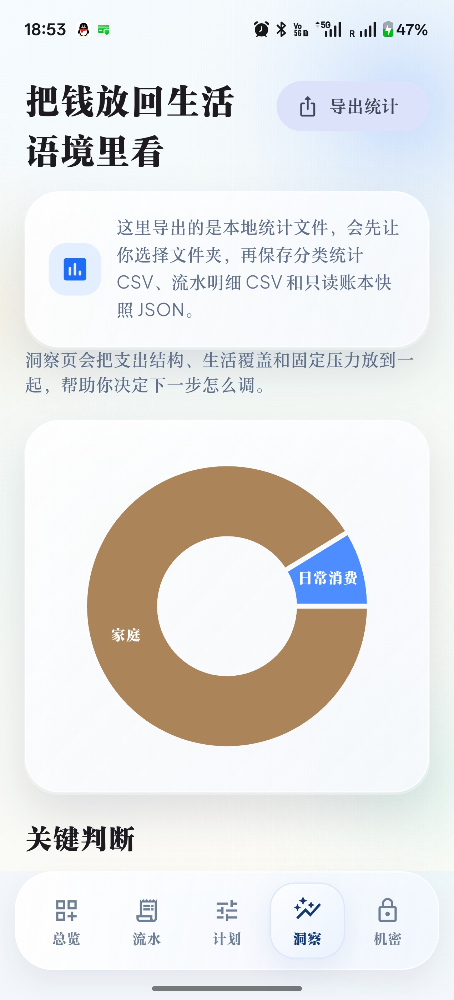

# 潮汐账本 (Chaoxi Jizhang)

> 一款为中文用户打造的智能个人记账 App，基于 Flutter 开发，支持自动记账、位置智能化、AI 分析洞察，数据本地加密存储。

<p align="center">
  <a href="https://github.com/Evelorion/chaoxi-jizhang/releases/latest">
    
  </a>
  
  
  
</p>

---

## 📥 下载安装

**[→ 点击下载最新版 APK](https://github.com/Evelorion/chaoxi-jizhang/releases/latest)**

> 下载 `app-release.apk`，安装时需在手机上允许「未知来源」应用安装。

---

## 📚 技术文档

| 文档 | 内容 |
| --- | --- |
| [01 · 架构总览](docs/01-架构总览.md) | 两条主链路、三条速度路径、决策树、代码地图、八条设计原则 |
| [02 · 算法：通知到账单](docs/02-算法-通知到账单.md) | 采集、模板学习、AI 生成、四道防线、关联打分、冲突优先级、学习闭环 |
| [03 · 算法：问账本](docs/03-算法-问账本.md) | 查询 DSL、上下文继承、统计缓存、模糊检索（FTS + 向量）、token 预算 |
| [04 · 数据模型](docs/04-数据模型.md) | 流水字段、模板、统计、FACT/INFERRED、序列化兼容 |
| [05 · 本地模型与性能](docs/05-本地模型与性能.md) | 模型清单与校验、引擎生命周期、实测性能、后台服务 |
| [06 · 开发 / 构建 / 验证](docs/06-开发-构建-验证.md) | 构建、签名、adb 验证配方、测试清单、已知限制 |
| [本次改动说明](docs/本次改动说明.md) | 面向使用者的完整改动记录（含真机问题与根因）|
| [CHANGELOG.md](CHANGELOG.md) | 按版本整理的更新日志 |

> 一句话总结这套架构：**AI 负责理解语言，程序负责事实、统计和执行；规则负责速度。**

## ✨ 核心功能

### 🤖 自动记账
- 监听微信、支付宝、Google Pay、京东、淘宝、拼多多、闲鱼、银行支付通知，**自动抓取金额、商家、卡尾号**
- **通知先落盘、再排队、最后才谈 AI**：监听回调只做「存原文 + 入队 + 返回」，永不阻塞系统线程；
  队列存在应用私有目录，进程被杀也不丢
- **三条处理路径，越用越少依赖 AI**：
  - ① 模板快路径：同类通知见过 ≥3 次 → 直接复用结论，**不调用模型**
  - ② 商户缓存：这个商户判断过一次 → 直接复用，**不调用模型**
  - ③ 千问：新商户 / 新格式 → 生成标题、商户、付款人、分类、标签、备注、心情
  设置页会显示比例，例如「已处理 40 条：不用模型 72%（模板 12 · 商户缓存 17 · 千问 11）」
- **金额和收支方向只来自通知解析**，模型拿不到这两个字段的写权限；没有模型时通知留在队列等待，不会用规则猜一个
- **解析失败不丢通知**：严格 JSON → 文本抢救 → 修复轮 → 仍失败则按「待确认」落账，你改一次分类它就会记住
- **多通知合并成一笔**：微信付款 + 电商订单 + 银行扣款按关联打分合并（≥90 分才自动合并；
  同价不同店绝不误并），并保留「招商银行 ••8821」这样的资金来源账户
- **转账单独成一类**：微信/支付宝的转账既不记成支出也不记成收入（给家人转的钱不会撑大当月开销），
  方向和对方名字都从通知里提取，且不占用模型
- **异常提醒**：疑似重复扣款、同商户突然涨价、金额明显高于日常，由本地统计发现，千问只负责用一句人话解释
- **原文可回看**：设置页「自动记账处理情况」显示收到 / 已识别 / 没认出 / 待确认 / 积压条数，
  可点「查看通知原文」逐条核对「收到了什么 → 记成了什么」

### 🧠 本地千问（离线 AI）
- 应用内提供三个版本：**千问轻量版 429 MB**（推荐）、**千问清晰版 805 MB**、**千问标准版 1.28 GB**，可分别下载、切换和删除
- 下载入口收在「机密 → 离线千问（本地 AI）」的小卡片里，点进去才是下载页；下载交给安卓系统在后台完成，**退出应用、锁屏都会继续**
- 文件大小和 SHA-256 都写死在应用里：下载完成后逐字节校验，校验不通过就删掉重下，绝不把没下完的模型标成可用
- 下载中断会自动重试（最多 3 次，间隔 5/20/60 秒）；如果判断是下载地址本身的问题，会**自动换成备用地址**重试
- 如果系统下载服务在最后一段网络上出错、一直显示“重试中”，但字节数已经收全，应用会直接进入校验，不让你白等
- 在「洞察 → 问问账本」像聊天一样连续提问，例如先问“今天消费了多少？”，再追问“付款方是谁？”。**对话和上下文存在加密账本里，退出应用、重新解锁后还能接着问**
- 「洞察 → 语音问账单」是独立的语音入口：点开就开始听，说完自动出答案；手机没有语音识别时会提示改用键盘麦克风
- **两级模型**：装多个模型时，记账自动用最小的那个（快、省电），问答用你在设置里选的那个
- **问账本不再让模型读账**：模型只把问题翻译成一行「查询条件」（约 300 字，零账目），
  本地算出结果后再让模型说一句话；账目 5 万笔也一样快
- **追问不串题**：问「这个月麦当劳多少」→「上个月呢」（只换时间）→「星巴克呢」（只换商户）→
  「今天一共花了多少」（开新查询，不再粘着星巴克）
- **模糊查找**：说不清商户和分类时（例如「前几天买手机配件那笔」），
  走 bigram 全文检索 + 本地向量余弦重排，只把最像的 5 条交给模型挑
- 模型推理不调用云端 AI。通知监听仅限受支持的支付应用，不获取聊天数据库，也不控制其他手机应用
- 设备不支持时（32 位手机、部分模拟器）应用会提前说明原因，不会让你白下载一个用不了的模型

### 📍 位置智能化
- **精确定位**：订阅设备定位流，尽快取到最准的一帧，最长等 18 秒；拿不到就用 30 分钟内的上次位置兜底
- **中文地址到街道**：反查地址固定用简体中文，并取到「市 + 区 + 街道」一级，例如“北京市东城区东华门街道 · 39.90870, 116.39750（卫星定位，约±5米）”
- **来源写清楚**：每条位置都标注是“卫星定位”“上次定位”还是“网络大致位置”，不会把网络位置说成精确定位
- **地址查不到也留坐标**：网络不好时至少保存经纬度，不会整条丢掉
- **网络大致位置**：仅在明确选择网络定位模式时使用
- **自动记账记录位置**：自动记账时可选择异步附加当前位置
- **常用地点管理**：收藏高频消费地点，自动匹配模板

### 🎙️ 语音速记
- 长按麦克风按钮语音输入，支持中文自然语言解析
- 自动识别金额、分类、商家、备注

### 📊 洞察分析
- 月度收支趋势、分类占比图表
- 区域消费分布（基于定位数据）
- 订阅雷达：识别并追踪周期性支出
- 燃烧率预测：预估月底结余

### 🔐 隐私与安全
- 所有数据本地存储，**不上传任何云端**
- AES-GCM 加密落盘，机密模式支持金额遮罩
- 生物识别解锁（指纹/面容）
- 后台自动锁定

### 💰 预算与目标
- 自定义月度预算，实时进度追踪
- 设定储蓄/消费目标，可视化达成进度

### 🔄 订阅管理
- 识别月租、年费等周期性账单
- 到期提醒，避免忘记续费

---

## 🆕 v2.3.1 更新日志

### 修复「答非所问」（真机反馈）
- **根因**：查询条件解析失败时会退回「把整段流水塞进模型自由发挥」的老路，
  0.6B 小模型读一堆流水就开始幻觉（截图里的"您以后换了个项目了""需要调整账本设置吗"都是这么来的）
- **新顺序**：① 本地规则解析 → ② 模型翻译 → ③ 本地模糊检索 → ④ 如实说没听懂（给示例问法）
  **彻底删掉了会把流水塞给模型的兜底路径**
- 常见问法现在**完全不问模型**就能答，而且更快：
  「我最近有什么消费」「我有个78的消费记录吗」「今天花了多少」「这个月餐饮花了多少」
  「麦当劳花了多少」「最近一笔是什么」「什么时间」「上个月呢」
- **新增金额查询**：说得出金额就能精确找（"78 的消费记录"）
- **追问补齐**：「什么时间」「多久」会继承上一轮的金额/商户条件，直接答出日期
- **模型没装也能答常见问题**：本地规则路径不依赖模型（以前会直接提示"还没有下载模型"）
- 顺手修掉一个误判：本地预筛没命中时会立刻回"没有找到符合条件的账单"，
  现在这层预筛已经取消（它和规则解析是重复的）
## 🆕 v2.3.0 更新日志

### 本地 AI 自动记账引擎（本轮主线）
- **AI 变成「补洞工具」而不是系统中心**：程序先判断、缓存先命中、模板先复用，只有真正不确定的部分才叫模型
- **三条速度路径**：通知模板（≥3 次命中即免模型）/ 商户缓存 / 千问，界面直接显示「不用模型 xx%」
- **四道防线**：严格 JSON → 文本抢救 → 修复轮 → 按「待确认」落账，通知绝不静默丢弃
- **关联打分合并**：金额 40 / 时间 25-10 / 角色互补 20-15 / 同卡尾号 25 / 付款成功 10，≥90 才自动合并；
  多个同强候选时宁可不合并（避免把两笔真实消费并成一笔）
- **商户 / 支付渠道 / 资金来源三字段分离**：淘宝 · 微信支付 · 招商银行 ••8821
- **冲突解析**：金额信银行、商户信电商、分类信用户（用户修改 > 商户缓存 > 通知模板 > 千问）
- **FACT / INFERRED 分离**：金额、时间、卡号是事实永不重写；分类、标题等推测字段将来可只重跑这部分
- **延迟画像与通知顺序学习**：自动学到「银行通知最晚 42 秒到」，据此放宽合并窗口
- **异常提醒**：疑似重复扣款 / 突然涨价 / 金额异常，统计发现，千问只负责解释
- **后台常驻服务**：队列非空时前台服务保活，切后台、锁屏继续整理，队列清空自动停

### 问账本（读取侧重做）
- **模型不再读账本**：只把问题翻译成一行查询条件（约 300 字），本地算完再让模型说一句话
- **十种查询意图**：sum / count / average / compare / top_merchant / top_category / latest /
  monthly_summary / find / fuzzy，全部本地执行，模型永远不会生成 SQL
- **上下文管理**：追问继承、换实体、开新查询三种关系自动区分，不再「问什么都围绕上一题」
- **模糊检索**：中文 bigram 全文检索 + TF-IDF 向量余弦重排，Top5 交给模型；无关问题不硬凑
- **统计缓存**：按天/按月预聚合，版本变了自动重建，结构上不可能与账本不一致

### 修复
- 所有手机（含 arm64）被误判成「不支持本地 AI」——探针参数顺序错误
- 「商家：」被当成「家」导致所有付款都记成家庭——关键词与标签前缀双重修正
- AI 正在思考时退出页面会丢掉这次问答——答案改为无论页面是否存活都写回账本
- 模型把商家名抄成付款人——提示词 + 应用层双重拦截，宁可为空也不编造
- 换电脑后 gradle 报 keystore 错误——项目内自带 debug 签名（见文档 06 §3）

### 性能
- 首页空闲帧 603 → 140（10 秒），CPU 46~50% → 0%；洞察页滚动卡顿 1.14% → 0.23%
- 铁律：**动画必须一次性，只做 transform/opacity，禁止循环**

> v2.2.0 里的「AI 按需读取（工具调用）」已被本轮的**查询条件 DSL** 取代：
> 结构更小、更稳，且同样不会把账目塞进提示词。
## 🆕 v2.2.0 更新日志

### AI 按需读取
- 不再把整段流水预先塞给模型：先只提供「能查什么」，由模型自己决定读哪一块
- 三个查询工具：按时间段读（range）、按商家/关键词找（search）、读最近几笔（recent）
- 应用在本地瞬间取数；模型没吐出规范工具调用时自动退回「本地筛好再问」的兜底路径

### AI 提速
- 提示词从约 4148 字压到 895 字（明细 30 条→15 条、历史 6 句→4 句），模型"读"的时间降到约 1/5
- 回答长度上限 360→180 token，并要求 3 句话以内
- 推理线程按 CPU 核心数自动选择（8 核机型用 6 条）；上下文 8192→4096
- 打开聊天页就后台预加载模型，离开页面不立刻释放（空闲 5 分钟才释放）
- 等待期间显示已用秒数

### 丝滑动画
- 切换底部标签：内容淡入 + 轻微上浮（240ms）
- 洞察页饼图 / 柱状图扫入动画，首页「本月净结余」数字滚动
- 悬浮记账按钮按下回弹；所有动画都是一次性的，没有循环动画
- 机密模式打码时数字不滚动，避免动画泄露真实金额

### 流畅度
- 修复首页静止时一直 60fps 重画、吃掉约半个 CPU 核的问题（快捷记账按钮的呼吸动画）
- 卡片增加重绘边界，滚动时不再每帧重新栅格化模糊阴影（洞察页滚动卡顿率 1.14% → 0.23%）
- 去掉每 20 秒一次的无谓界面重建，并缓存五个标签页实例
- 模型卡片、自动记账卡片的轮询只在页面可见时进行

### 自动记账管道
- 收到通知先原样存进「通知原文收件箱」，解析失败也不会丢；再进「待处理队列」顺序处理
- 监听线程只负责存原文 + 入队，AI 处理不阻塞通知监听，新通知处理期间继续排队
- 写入按通知 id 幂等，处理完成后才移出队列（标记已完成）
- 设置页新增「自动记账处理情况」卡片 + 「查看通知原文」页，可以逐条核对识别结果
- 修复严重识别错误：家庭分类的关键词“家”会命中每条通知里的“商家：XXX”，
  导致几乎所有自动记账都被记成“家庭”；现在先去掉标签再匹配，并清理了容易误伤的短关键词
- 规则有把握时不再让模型改写分类，只有规则拿不准的记录才交给千问

### 修复与改进
- **离线 AI 真正接入应用**：模型下载、校验、安装状态和聊天、通知分类全部串起来，装好即可用；界面上不会再出现英文报错和整屏堆栈
- **AI 下载更稳**：下载中断自动重试、必要时自动换备用地址；系统下载服务卡在“重试中”但文件已经收全时，应用会直接校验并使用
- **AI 入口收进设置**：设置页只留一张小卡片显示状态，下载、换版本、删除都在卡片里，支持后台下载和随时删除
- **连续对话与记忆**：聊天式界面，追问“付款方是谁”这类问题会带着上一轮找到的账单；对话存在加密账本里，重启应用还在
- **新增「语音问账单」独立入口**：放在洞察页，点开就能说话提问；语音速记也改成了真正的语音输入
- **定位更准**：定位失败会逐级兜底，地址固定返回简体中文并细到街道，同时标明来源和误差范围
- **文案中文化**：洞察、隐私、位置、AI 等页面里生硬的技术词改成了日常说法（例如“兜底类别”→“默认分类”，“生活维度热力表”→“各类开销一览”）
- **修复调试构建**：本机 `~/.android/debug.keystore` 口令损坏导致所有 debug 构建失败，改用项目内 `android/debug.keystore`

---

## 🆕 v2.1.0 更新日志

### 新增功能
- **网络大致位置**：可手动选择通过网络 IP 获取城市级大致位置
- **自动记账定位开关**：设置 → 位置记账助手，可选是否在自动记账时记录位置
- **精确定位优先**：记录设备实际位置和精度，不再让网络位置覆盖 GPS

### Bug 修复
- 修复 Nominatim 在中国大陆不可达导致的定位失败，改用 BigDataCloud
- 修复定位等待时 UI 卡顿（转圈）问题
- 修复关闭记账表单后定位回调触发的 `setState-after-dispose` 崩溃
- 修复 Release APK 因缺少签名配置无法构建的问题

[查看完整 Release Notes →](https://github.com/Evelorion/chaoxi-jizhang/releases/tag/v2.1.0)

---

## 🏗️ 技术栈

| 层级 | 技术 |
|------|------|
| UI 框架 | Flutter 3 / Dart |
| 状态管理 | Riverpod |
| Android 原生 | Kotlin（通知监听服务） |
| 图表 | fl_chart |
| 定位 | geolocator + BigDataCloud + ipwho.is |
| 加密 | AES-GCM（Android Keystore） |
| 生物识别 | local_auth |
| 存储 | flutter_secure_storage |

---

## 📂 项目结构

```
lib/
  main.dart
  src/
    app.dart                    核心控制器 & 全部 UI
    location_helper.dart        位置获取、反向地理编码
    ui_location_map.dart        消费地图可视化
    ui_voice_fab.dart           语音速记浮动按钮
android/app/src/main/kotlin/
  .../MainActivity.kt
  .../LedgerNotificationListenerService.kt   通知监听
  .../NotificationParser.kt                  金额解析
  .../VaultCipher.kt                         加密层
test/
  ledger_book_test.dart         单元测试
```

---

## 🔧 本地开发

```bash
# 安装依赖
flutter pub get

# 代码检查
flutter analyze

# 运行测试
flutter test

# 调试运行
flutter run

# 打包 Release APK
flutter build apk --release
```

> **注意**：如需正式签名，将 `key.properties` 放置于 `android/` 目录，否则自动使用 debug 签名构建。
>
> 如果本机 `~/.android/debug.keystore` 的口令和默认值不一致，debug 构建会报
> `keystore password was incorrect`。项目会自动改用 `android/debug.keystore`
> （该文件已在 .gitignore 中，不会提交），也可以手动生成：
>
> ```powershell
> keytool -genkeypair -storepass android -alias androiddebugkey -keypass android `
>   -keyalg RSA -keysize 2048 -validity 10000 -dname "CN=Android Debug,O=Android,C=US" `
>   -keystore android/debug.keystore
> ```

本地 AI 推理库要求 Android 8.0（API 26）及以上、64 位 ARM 处理器。模型下载需要联网和足够存储空间，推理速度取决于手机内存与 CPU。

---

## 📸 应用截图

<table>
  <tr>
    <td align="center">
      
      <div><strong>首页</strong><br/>收支汇总 · 快速记账</div>
    </td>
    <td align="center">
      
      <div><strong>流水</strong><br/>筛选 · 自动记账 · 来源追溯</div>
    </td>
    <td align="center">
      
      <div><strong>洞察</strong><br/>图表 · 区域分布 · 预测</div>
    </td>
  </tr>
</table>

---

## 📄 许可证

本项目仅供个人学习与使用，暂未开放商业授权。

---

<p align="center">
  <strong>潮汐账本</strong> · 让记账像潮水一样自然
</p>
