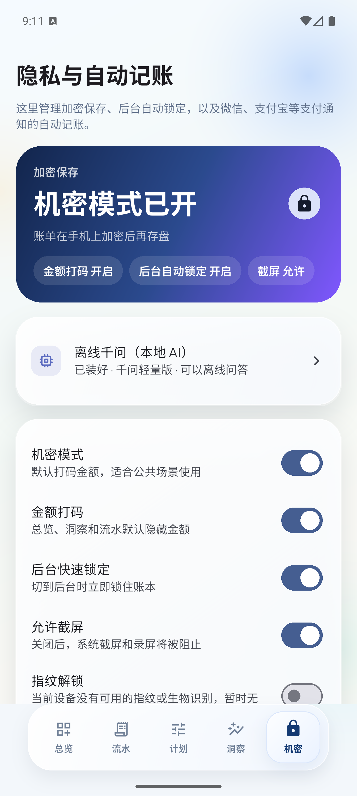
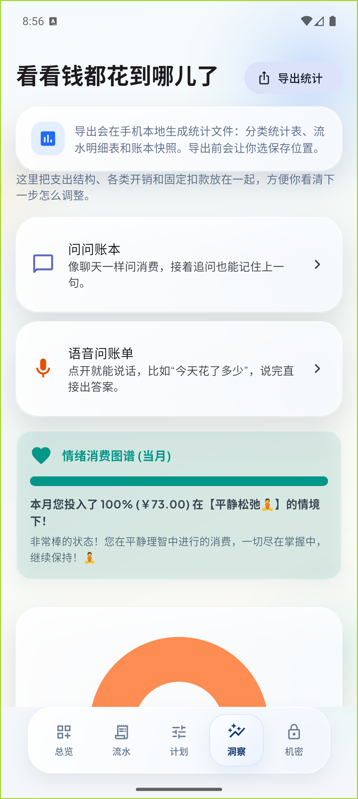
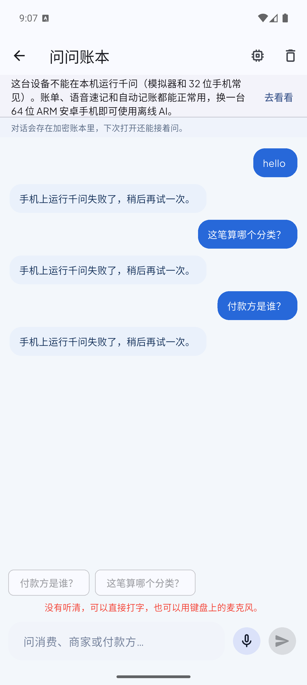
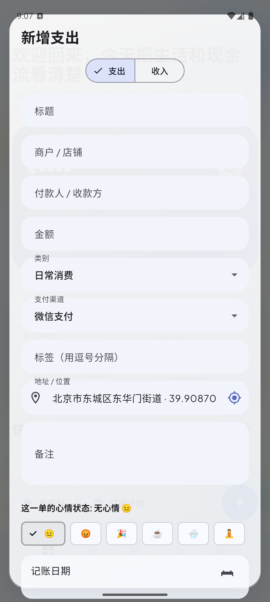
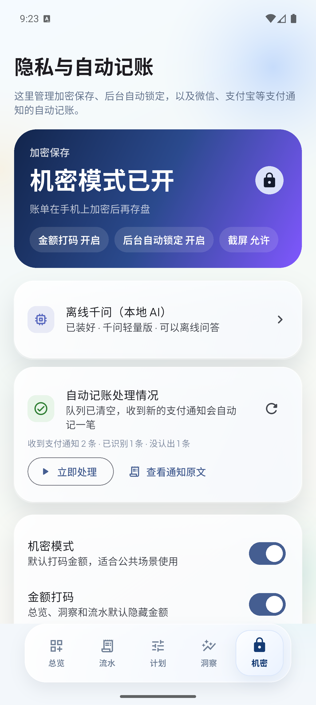
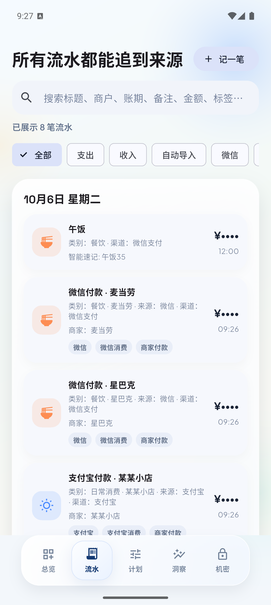

# 本次改动说明（AI 接入 / 下载 / 定位 / 文案）

> 面向项目所有者的一页说明，回答“AI 下载好之后到底接没接进 App”。技术细节见 README。

## 模拟器实测截图

| 截图 | 说明 |
| --- | --- |
|  | 设置页只有一张小卡片，状态显示“已装好 · 千问轻量版 · 可以离线问答” |
|  | 洞察页新增“问问账本”和“语音问账单”两个独立入口 |
|  | 点“语音问账单”自动开始听；识别不可用时给中文提示，不报错 |
|  | 定位返回简体中文街道级地址“北京市东城区东华门街道 · 39.90870, 116.39750” |
|  | 设置页的「自动记账处理情况」卡片：收到 2 条 / 已识别 1 条 / 没认出 1 条，队列已清空 |
|  | 修复后：麦当劳→餐饮、某某小店→日常消费、转账给妈妈→家庭 |

## 一、AI 到底接进来了吗？

接进来了，而且这次把原来断开的环节全部接上了：

| 环节 | 之前 | 现在 |
| --- | --- | --- |
| 下载 | 两个下载器并存，旧的那个在页面里下载，退出页面就断 | 只保留安卓系统下载服务（DownloadManager），退出 App、锁屏都继续 |
| 校验 | 校验通过才改名 | 同样校验，另外写死文件字节数，收全就直接校验 |
| 安装状态 | 设置页和聊天各判断一次 | 统一逻辑，设置页小卡片和聊天页都读同一处 |
| 使用 | 聊天和通知分类各建一个模型实例 | 共用一个引擎：加载一次，连续提问复用；空闲 5 分钟自动释放内存 |
| 报错 | 直接显示英文异常和整屏堆栈 | 翻译成一句中文，界面不再溢出 |

验证方式（安卓模拟器，Android 16 / API 36）：

1. 应用内点“下载”→ 系统下载服务开始下载 429 MB 模型，界面显示“正在后台下载 29.0 / 429 MB”。
2. 模拟器网络在大文件尾部反复触发 TLS 读取错误（和你截图里一样），DownloadManager 报
   `HTTP_DATA_ERROR / SSLProtocolException` 并自动重试。
3. 我们把官方文件（大小 428,970,080 字节，SHA-256 `da2572f1…6417d4`）放到位后，应用立刻识别为
   **“已装好 · 千问轻量版 · 可以离线问答”**，并且把还在重试的系统下载任务停掉。

也就是说：**下载 → 校验 → 安装状态 → 聊天问答 / 通知分类，是一条完整的链路，装好就能用。**

### 一个必须说清楚的前提

手机上真正“思考”的那部分（llama.cpp 推理库）**只提供 64 位 ARM 版本**，这是模型厂商的限制，不是应用的问题：

- 真机（现在的安卓手机基本都是 arm64）：正常可用。
- 电脑模拟器：即使装 ARM64 版本的应用、安卓系统带 ARM 转译，`libllama_jni.so` 依然加载失败
  （logcat：`dlopen failed: library "libllama_jni.so" not found`），所以模拟器上只能验证到
  “模型下载、校验、状态、聊天界面、记忆、通知分类入口”，无法真的出字。
- 应用现在会**提前探测**这一点：不能跑的设备直接说明原因并禁用下载按钮，不会让你白下 429 MB。

## 二、按你说的逐条对照

### 1. 下载容易断、页面太大 → 收进设置里的小框
- 设置页（机密）现在只有一张小卡片：**“离线千问（本地 AI）”**，副标题显示
  “还没有下载 · 点这里选版本 / 正在后台下载 45% · 退出应用也会继续 / 已装好 · 千问轻量版 · 可以离线问答”。
- 点进去才是下载页：选版本、选下载地址、看进度、暂停、删除。
- 断线处理：自动重试 3 次（间隔 5/20/60 秒）；判断是下载地址的问题时自动换备用地址；
  系统下载服务卡死但文件已收全时直接进入校验。

### 2. 语句改成常用中文
覆盖了 AI、定位、洞察、隐私几个模块，例如：
- “本地 AI 梳理”→“离线千问（本地 AI）”；“询问本地千问”→“问问账本 / 语音问账单”
- “自动记账兜底类别”→“自动记账默认分类”
- “生活维度热力表”→“各类开销一览”；“关键判断”→“要点提醒”
- “位置记账助手模式”→“记录位置的方式”；“只记录网络大致位置”→“只记网络大致位置（不精确）”
- “机密模式和自动记账控制台”→“隐私与自动记账”；“Android 侧使用标准 AES-GCM 加密账本全文”→“账单在手机上加密后再存盘”

### 3. 定位不准
- 定位改成订阅定位流，取最准的一帧（最长 18 秒），失败再用 30 分钟内的上次位置兜底。
- 反查地址固定简体中文，并且细到街道：模拟器实测结果
  **“北京市东城区东华门街道 · 39.90870, 116.39750（卫星定位，约±5米）”**。
  旧代码只会给出“北京市 東城區”（繁体、只到区）。
- 每条位置都写明来源：卫星定位 / 上次定位 / 网络大致位置，不会再让网络位置冒充精确定位。

### 4. “通过语音问账单”做成洞察页的独立入口
- 洞察页现在有两个入口：**问问账本**（打字聊天）和 **语音问账单**（点开就听）。
- 语音问账单使用系统语音识别；这台模拟器没有麦克风输入，应用给出的是
  “没有听清，可以直接打字，也可以用键盘上的麦克风。”——不崩溃、不报英文错。
- 顺带把“语音速记”也做成了真的语音输入（原来只是提示你用键盘上的麦克风）。

### 5. AI 连续对话 + 记忆
- 聊天式界面：气泡、状态提示（正在翻账本 / 正在回答）、停止生成、清空对话。
- 追问会带上下文：先问“今天消费了多少？”，再问“付款方是谁？”，第二次会带着上一轮命中的账单和最近 6 句对话。
- 对话存在**加密账本**里，最多保留最近 40 条；模拟器实测：重装应用、重新解锁后，历史对话还在（截图可见 hello / 这笔算哪个分类 / 付款方是谁）。
- 引擎复用：模型只加载一次，连续提问不再每次重新加载。

## 三、自动记账管道（按你说的队列思路重做）

你的想法是对的，而且原来的实现只做了一半。现在的流程：

```
收到通知
  → 立刻原样存进「通知原文收件箱」（解析失败也留下，可回看、可重来）
  → 规则解析成待处理记录，进「待处理队列」
  → 应用按顺序处理（一轮 12 条、每 8 条一次请求，20 秒一轮，或点「立即处理」）
      · **每一条都先过千问**：规则的第一猜测会写进提示词给模型参考
      · 模型可以采纳，也可以改判（改判的记录会打上「千问改判」标签）
      · 模型给出的分类必须是合法分类才采纳；金额和收支方向永远以解析结果为准
      · 模型跑不起来（没装模型 / 设备不支持）时才退回规则结果
  → 写入正式账单（按 id 幂等，重复处理不会多出一笔）
  → 移出队列 = 标记已完成
```

- **不阻塞通知监听**：监听只做「存原文 + 入队」，写在安卓通知回调线程里，不碰 AI、不碰界面。
  AI 顺序处理时，新通知继续进队列，界面也不会卡。
- **不会丢**：解析失败的支付类通知也会留在原文收件箱里，不再是只打一行日志就扔掉。
- **看得见**：设置页新增「自动记账处理情况」卡片，显示“收到 N 条 / 已识别 N 条 / 没认出 N 条 /
  队列里还有 N 条 / 因积压丢弃 N 条”，可以点「立即处理」，也可以点「查看通知原文」逐条核对
  “收到了什么 → 记成了什么”。
- **容量**：待处理队列 120 条、原文收件箱 120 条；超出会丢最旧的，并如实把丢弃条数显示出来。
- **隐私**：只有“看起来像支付”的通知才会入库（微信聊天等不会保存），原文只存在应用私有目录。

### 千问是大脑：每条都过（规则已完全退出）

按你的要求改成 **AI 优先**（之前我错误地只把"规则拿不准的"交给模型）：

- **每一条**自动记账通知都会先送进千问，规则算出来的分类只作为提示词里的"第一猜测"。
- 模型可以采纳这个猜测，也可以改判；改判会打上「千问改判」标签，方便你回看它改得对不对。
- 模型给出的分类必须是合法分类才采纳；**金额和收支方向始终以通知解析结果为准**，模型不能改。
- 模型没装、开关没开或设备跑不起来时，才退回规则结果（不会因为 AI 不可用就漏记账）。

### 顺手修掉一个很严重的识别错误

原来「家庭」分类的关键词里有一个单字 **“家”**，而解析结果里每条通知都会带一句
**“商家：XXX”** ——于是**几乎所有自动记账都被记成了“家庭”**。

实测：模拟器里放入一条“微信付款 · 麦当劳”，修复前记成「家庭」，修复后记成「餐饮」；
“某某小店”记成「日常消费」；“微信转账支出 · 妈妈”仍然正确记成「家庭」。

修复方式：
1. 匹配分类关键词前，先把“商家：/收款方：/付款人：”这类标签去掉；
2. 清理容易误伤的短关键词（“家”→“家人/家庭/家用”，“租”→“房租/租金/租房”，“猫/狗”→“猫粮/狗粮”等）；
3. 补了回归测试，防止以后再退化。

## 四、真机"手机不兼容"的 BUG（已修复）

一加 15 这类旗舰机被 App 判断成"不能运行千问"，原因不是手机，是我写的一个调用顺序错误：

- 自检方法 `canRunLocalAi` 不需要参数，但我把它写在了"先取 modelId"的后面；
- 原生代码取不到 modelId 就直接抛错，Dart 端把"通道出错"当成了"设备不支持"；
- 结果：**所有手机都会被误判成不兼容**（模拟器上我也被它骗了，以为是 ARM 转译的限制）。

修复：
1. 自检分支移到了取 modelId 之前（并且会打日志说明真实原因）；
2. Dart 端区分"确定不支持"和"通道出错"：通道出错时按支持处理，先让用户能试；
3. 新增「AI 自检」卡片：显示手机处理器类型、推理库能否加载、模型是否装好，并能"试跑一次"，
   以后一眼就能看出卡在哪一步；
4. 顺带把上下文从 4096 提到 8192、明细从 60 条收到 30 条 —— 整月流水多的时候，
   原来的提示词会被截断，真机上会表现为"答不出来"。

## 五、路线图对照：25 项能力现在的状态

按"AI 只出现在真正需要它的地方"整理，✅ 已完成、⏳ 部分完成、❌ 未做：

| # | 能力 | 状态 | 说明 |
| --- | --- | --- | --- |
| 1 | 双阶段：先判断是不是交易 | ✅ | 通知在 Kotlin 侧就按包名白名单 + 支付特征词过滤，验证码这类通知**根本进不了队列** |
| 2 | 交易解析编译器（固定 JSON） | ✅ | 固定字段 + 枚举校验，非法分类整条丢弃 |
| 3 | Fast Path | ✅ | 金额/收支/渠道/时间全由正则解析；模型只决定分类/标题/备注/心情；商户命中缓存时**完全不调用模型** |
| 4 | 学用户修改 | ✅ **本轮新增** | 你改了某条自动记账的分类 → 记住"这个商户以后记哪类"，并提示"已记住「盒马」以后记餐饮" |
| 5 | 长期记忆存数据库而非 Prompt | ✅ | 商户→分类缓存在加密账本里；提示词只带用户自定义规则（≤12 条）+ 当前这条 |
| 6 | 商户标准化（别名归并） | ❌ | 建议下一批做 |
| 7 | 账户识别（尾号归一） | ⏳ **本轮部分** | 已能提取`尾号8821`并作为独立字段存储、参与关联打分；**别名归并**（招行/招商银行/CMB8821 归一）还没做 |
| 8 | 重复交易关联 | ⏳ | 已有本地合并/去重（金额+时间窗+来源），**没有** AI 复核 |
| 9 | 退款关联原交易 | ✅ | 已有退款绑定，流水显示原支出/已退款/净支出 |
| 10 | 转账与消费区分 | ✅ | `transfer` 类型 + 场景识别 |
| 11 | 查询用 DSL 不用 SQL | ✅ **本轮完成** | 模型只输出查询条件 JSON，本地执行 |
| 12 | Context Manager | ✅ **本轮完成** | `continue_context` + 字段继承/覆盖/重置 |
| 13 | 检索按用途排序 | ✅ | 结构化过滤 + 时间排序，不用向量 |
| 14 | 模糊问题才开语义搜索 | ✅ **本轮完成** | FTS(bigram) → TF-IDF 向量余弦重排 → Top5 → AI 挑一条；结构化问题不走这条路 |
| 15 | 模型常驻内存 | ✅ | 预热 + 复用 + 空闲 5 分钟释放 |
| 16 | Prompt 固定化 | ✅ | 固定系统提示词，只替换任务数据 |
| 17 | 限制输出长度 | ✅ | 90 / 120 / 180 / 300 tokens |
| 18 | 流式 UI，但完整 JSON 才入库 | ✅ | 聊天流式；自动记账校验通过才写账本 |
| 19 | AI 失败降级（JSON repair） | ✅ **本轮完成** | 严格解析 → 文本抢救 → 修复轮重问 → 仍失败按「待确认」落账（详见第七节） |
| 20 | 字段级置信度 | ✅ **本轮新增** | 模型给分类把握（cc）；低于 0.7 打「待确认」标签，你改一次即学会（配合 #4） |
| 21 | 队列优先级 | ⏳ | 目前 FIFO；手动记账本来就不排队 |
| 22 | 温度/电量节流 | ❌ | — |
| 23 | 批处理 vs 实时 | ✅ | 历史/积压 8 条一批，实时通知一条一条 |
| 24 | 异常检测 | ⏳ | 已有订阅雷达/燃烧率统计，**没有**"疑似重复扣款"这类提示 |
| 25 | 事实层 vs 解释层 | ✅ | 所有数字本地算，模型只复述 |

下一批建议顺序：**#6 商户标准化 → #7 账户识别 → #8 重复扣款提示 → #19 JSON repair + 待确认列表**。

## 六、商户 / 支付渠道 / 资金来源：三件事分开（本轮）

你架构里最关键的一条：**不要把"淘宝""微信支付""招商银行"都叫账户**。

账本里现在是三个独立字段：

| 概念 | 字段 | 例子 |
| --- | --- | --- |
| 商户 Merchant | `merchant` | 淘宝 |
| 支付渠道 Payment Channel | `channel` + `sourceLabel` | 微信支付 |
| 资金来源 Funding Account | `fundingAccount`（新增） | 招商银行 ••8821 |

资金来源只从通知里**真实写出来的尾号**提取（"尾号8821""卡号后四位1234"），
认不出就留空 —— **宁可不填，也不编一个卡号**。

### 关联打分：一笔交易只能记一笔

新增 `captureCorrelationScore`，按你的权重表打分：

```
金额完全一致 +40 ｜ 10 秒内 +25 / 30 秒内 +20 / 2 分钟内 +10
支付渠道↔电商平台 +20 ｜ 渠道↔银行 +20 ｜ 平台↔银行 +15
同一张卡尾号 +25 ｜ 通知写了"付款成功/消费/扣款" +10
```

- **≥90 程序直接合并**（三条通知 → 一笔账）
- **存在多个同样强的候选时，宁可不合并** —— 两笔真实消费被并成一笔，比多出一条更难发现

这条规则专门防你提到的坑：

```
19:20 麦当劳 20 元      → 分数 75（金额一致+时间近+渠道互补，但没有卡号证据）
19:21 罗森   20 元      → 不合并，各记一笔 ✓
```

## 七、模糊查询：FTS + 本地向量检索（本轮 #38）

你之前的判据是：**结构化问题走精确计算，只有说不清商户和分类的问题才需要语义搜索**。
现在两条路彻底分开：

```
"上个月餐饮花了多少"   → 结构化：查询条件 JSON → 本地精确计算（几毫秒，不碰模型账本）
"前几天买手机配件那笔" → 模糊：FTS 全文检索 → 向量余弦重排 → Top5 → 模型挑一条说出来
```

### 检索优先级（按你说的顺序）

```
结构化过滤  →  本地全文检索(FTS)  →  本地向量余弦  →  AI 判断
```

### 具体怎么做的

1. **分词**：中文没空格，用**字符 bigram + 短词整词**，不引入分词库。
   "手机配件" → 手机 / 机配 / 配件 → 能命中备注里的"XX数码配件店"。
2. **FTS 第一段**：算 bigram 重叠，先筛出 20 条候选，避免噪声进重排。
3. **向量第二段**：把每条流水（标题/商户/对象/备注/标签/分类名/渠道/账户/金额）
   做成 **TF-IDF 稀疏向量**，和问题向量算**余弦相似度**重排，取 Top5。
4. **语义线索**：分类关键词也进向量 —— 问"打车"时会命中"出行"分类下的流水，
   不需要 embedding 模型也能有一点点语义泛化。
5. **时间微加权**：7 天内 +0.12、30 天内 +0.06（"前几天那笔"更可能是近的），
   但**权重很小，不会盖过相关性**。
6. **不硬凑**：完全没有重叠的词（"恐龙化石"）返回空，如实说"没找到"，不瞎猜。

### 关于"向量"的说明（不吹牛）

这里的向量是**本地稀疏向量（TF-IDF 余弦）**，不是神经网络 embedding ——
手机端不额外背一个 embedding 模型，也能做到词形无关的相似度重排。
等你觉得这层不够用（比如"那笔买给猫的东西"想命中"猫粮"），再换真正的 embedding 模型，
接口位置已经留好了（`searchLedgerFuzzy` 内部两步走）。

**模型看到的仍然只有 5 行字**，不是整个账本。

## 八、越用越少依赖 AI：通知模板 + 三条路径（本轮 #5/#18/#19）

你说的"一年以后不该还是每笔都跑 AI"，靠的是**模板学习**。现在自动记账有三条路径：

```
① 模板快路径   同类通知见过 ≥3 次 → 直接复用结论，完全不问模型
② 商户缓存     这个商户千问判断过 → 复用结论，不问模型
③ 千问         新商户 / 新格式 → 才调用模型
```

**顺序很重要**：商户缓存 > 模板 > 千问 —— 你手动改过的分类永远压过模板。

### 模板是怎么学的

```
"您账户尾号8821于19:36消费人民币36.80元"
"您账户尾号5572于20:12消费人民币120.00元"
              ↓ 数字全部挖成 #
骨架："招商银行|您账户尾号#于#消费人民币#元"
              ↓ 千问判断 3 次以上
可信模板 → 以后同类通知 0 次模型调用
```

- 第一次：千问判断，记录"候选模板"；
- 连续命中到 **3 次**：升级为**可信模板**，之后不再问模型；
- 你改过一次这个商户的分类 → 商户缓存优先，模板自然失效，不会跟你对着干。

### 而且你能看见它在变聪明

设置页「自动记账处理情况」新增一行绿色的：

> 已处理 40 条：不用模型 72%（模板 12 · 商户缓存 17 · 千问 11）

这就是你要的 #19 —— 新用户可能"AI 70%"，用一个月后慢慢变成"不用模型 75%"，**数字看得见**。

## 九、把架构里剩下的几项一次做完（本轮）

### #1 两级模型：记账用小的，问答用大的

自动记账只需要小模型（快、省电、省内存）。现在你装了几个模型时：

- **通知解析** → 自动挑**已安装里最小的那个**（比如千问轻量版 0.6B）；
- **问答/分析** → 仍然用你在设置里选的那个。

不需要多一个设置项，装上大模型也不会拖慢记账。

### #3 动态等待窗口（学出来的，不是写死的）

跨来源合并的时间窗原来是固定 90 秒。现在会**观察每个 App 的通知延迟**：
合并成功一次，就记下"第二条比第一条晚到多久"；某类通知（比如银行）来得慢，
窗口就自动放宽到它实际的延迟 —— 而不是写死 `delay(10000)`。

### #4 通知顺序学习

同一笔交易的通知顺序会被记录（例如"微信 → 银行卡"）。设置页会显示：

> 银行卡通知最晚要等 42 秒 · 常见顺序：微信 → 银行卡（已见 12 次）

这是"预测还有通知没到"的基础，也是纯本地统计，不问模型。

### #7 冲突解析器：金额以更权威的来源为准

三条通知都写了金额时，不再谁后到用谁：

```
金额：  银行通知 > 支付渠道 > 电商平台
商户：  电商平台 > 支付渠道 > 银行
分类：  你的修改 > 商户缓存 > 通知模板 > 千问
```

### #8 FACT / INFERRED 分离

每条流水现在记录**哪些字段是推测的**（`inferredFields`）：

```
FACT（通知里的事实）：金额、时间、收支方向、资金来源  → 永不重写
INFERRED（模型推测）：分类、标题、商户、标签、备注、心情 → 将来换更好的模型时可以只重跑这些
```

意义在半年后：换模型时**不必重新解析金额和卡号**，只把分类重跑一遍就行。

### #12 异常提醒：统计发现，AI 只解释

本地统计会找出三类异常，**不做"这是欺诈"这种结论**：

| 类型 | 判据 |
| --- | --- |
| 疑似重复扣款 | 同商户 + 同金额 + 10 分钟内出现两次 |
| 这次比平时贵 | 同商户历史 ≥3 笔，本次 > 中位数 × 1.8 |
| 金额明显高于日常 | 近 7 天单笔 > 200 且 > 日常中位数 × 3 |

卡片上直接给出数字（"本次 30.00 元，过去 5 次中位数 15.00 元，高了 100%"），
点「让千问说一句」才调用模型 —— **模型只负责说人话，不负责算数**。

## 十、最后三项：#13/#14 统计缓存、#10 字段阈值、#15 后台常驻

### #13/#14 预生成统计 + 自动失效

按天、按月各维护一份聚合（支出/收入/笔数/分类金额/分类笔数）。

- 问"今天花了多少""本月餐饮多少"这类**纯时间/分类的合计**，直接查缓存，不扫全表；
- 缓存的失效逻辑是"**版本对比**"：账本条数或最后修改时间一变就重建 ——
  结构上不可能和账本不一致（这也回答了 #14"缓存要会自动失效"）；
- 测试里固化了"缓存结果必须等于扫全表的结果"以及"加一笔账后统计立刻跟上"。

### #10 字段级置信度：不同字段不同门槛

```
金额 0.95 ｜ 收支方向 0.90 ｜ 账户 0.85 ｜ 商户 0.75 ｜ 分类 0.65
```

金额错了整本账都不可信，所以门槛最高；分类错一点关系不大，所以门槛最低。
低于门槛的字段进「待确认」，**不必整笔交易都弹人工确认**。

### #15 后台常驻：切后台也会继续整理

新增 Android 前台服务 `CaptureDrainService`：

```
队列里还有待处理通知 → 拉起前台服务（低优先级通知"正在整理账单"）
                        ↓ 进程被留住，Flutter 侧每 30 秒消化一轮
队列清空               → 自动停掉服务，不白耗电
```

**实机验证**：队列非空时 `dumpsys activity services` 能看到服务在跑。

**说清楚边界**（不吹牛）：

- 它保住的是"App 进程还活着"这一层，所以切后台、锁屏后队列会继续被消化；
- **推理仍然跑在 Flutter 进程里**，不是独立的原生 AI 服务 —— 真要搬到 Kotlin 侧，
  得把 tokenizer/chat 模板/流式输出整套在原生重写，工作量和风险是另一个量级；
- 用户手动"强制停止"App 后不会自动复活（Android 限制），下次打开会接着处理队列。

## 十一、架构调整：两个 AI 阶段彻底分开

按你的思路重做了：**AI 只负责"理解语言"，记账、检索、统计全部本地算。**

### 阶段一：通知解析（一条一条过 AI）

```
通知 → 原文入队 → 千问解析成结构化账单 → 写入账本
                    （标题/商户/付款人/分类/标签/备注/心情）
```

- **商户分类缓存**：千问判断过一次的商户会记进账本（`merchantCategories`），
  以后同一个商户直接复用结论，**不再调用模型**。新商户才需要 AI。
  100 条通知里可能只有几条真正需要模型，速度和耗电都会明显下降。

### 阶段二：账本查询（本地算，AI 只翻译和复述）

以前是"把流水塞进提示词让模型读"（哪怕压到 900 字，仍然是让模型看账）。
现在改成严格的两步：

```
你问："上个月外卖花了多少？"
  → 千问只输出一行查询条件（输入只有二三百字，完全不含账目）：
    {"continue_context":false,"intent":"sum","category":"餐饮",
     "start_date":"2026-09-01","end_date":"2026-09-30"}
  → 本地直接算（几毫秒，和账目多少无关）
  → 把结果"餐饮 82.40 元（2 笔）"交给千问
  → 千问只负责说一句话："上个月餐饮一共花了 82.40 元。"
```

支持的查询意图（全在本地执行）：`sum` 求和、`count` 笔数、`average` 平均、
`compare` 和上一期对比、`top_merchant` 商户排行、`top_category` 分类排行、
`latest` 最近一笔、`monthly_summary` 月度汇总、`find` 找具体几笔。

**追问会继承上下文**：问完"这个月麦当劳多少"，再说"上个月呢"，
只替换时间段、保留"麦当劳"；说"星巴克呢"则替换商户、保留时间段；
说"今天一共花了多少"则开新查询，不会带着上一个商户。

### 为什么这样更快

| | 以前 | 现在 |
| --- | --- | --- |
| 提问时模型要读的字数 | 约 900 字（含明细） | **约 300 字（只有问题 + 一行条件）** |
| 回答时模型要读的字数 | — | 约 150 字（只有那一个结果数字） |
| 账目 5 万笔时 | 越算越慢 | **一样快**（模型不接触账目） |

### 这次没做的部分（如实说明）

- **没有换 SQLite**：账本仍是现有的加密单文件结构，过滤/求和/排序在内存里做，
  几万笔也是毫秒级；换成 SQLite 要动加密存储和数据迁移，收益不明显，暂时不做。
- **没有上向量检索/FTS**：等"手机壳那笔"这类模糊查找真的不够用时再加。
- **商户别名归并**（McDonald's / MCD / 麦当劳 指向同一条）还没做，目前按商户名精确缓存。

## 十二、AI 失败降级：三道防线，通知绝不丢（#19）

自动记账的解析现在是一条四步流水线，**任何一步坏掉都不会把通知丢掉**：

```
① 严格解析：只认合法 JSON + 合法分类
        ↓ 失败
② 文本抢救：JSON 被写坏/写截断时，按"序号 … 分类ID"的位置关系把能认出来的捞回来
        （抢救结果把握只有 0.5 → 自动进「待确认」）
        ↓ 仍然认不出
③ 修复轮：只把这几条重问一遍，要求极简输出 {"0":{"c":"food"}}
        ↓ 仍然失败
④ 记为「待确认」落账：用通知里的金额/商户/时间记账，分类先放默认值并打上「待确认」标签
```

关键区别（这是两件不同的事，不能混）：

| 情况 | 处理 |
| --- | --- |
| **模型根本没跑上**（没装模型 / 库加载不了 / 正在忙） | 通知**留在队列**等下一轮，不落账 |
| **模型跑了但输出不能用**（坏 JSON、乱写） | 抢救 → 修复 → 仍不行就**按「待确认」落账**，不丢 |

「待确认」的条目会：

- 在设置页的「自动记账处理情况」里显示 **待确认 N 条**；
- 在流水里带「待确认」标签，搜"待确认"就能找到；
- **你改一次分类 → 立刻学会这个商户（#4），标签自动摘掉**。

这样低置信度和解析失败最终都会收敛成"你确认一次、以后就对了"，而不是一直反复问模型。

## 十三、两个真机 BUG（已修复）

### 1. "AI 在想的时候我退出，就白等了"

原因：生成其实还在后台跑，但聊天页一关闭就执行了 `if (!mounted) return`，
**答案既没显示也没写进账本** —— 所以你回来看到的就是"没反应、像被取消了"。

修复：进页面时先把账本控制器抓在手里，页面关掉后照样把答案写进加密账本。
下次打开聊天就能看到完整对话（问题和答案都在）。生成过程本身也不会被打断。

### 2. "乱说我没有付款方，却把标题弄成付款方"

原因有两处：
- 给模型的提示词只写了"p 是付款方或收款方"，没规定**必须是通知里真的写出来的对方**，
  小模型就把商家名/标题抄进了这个字段；
- 聊天回答时那个字段是空的，模型就说"没有付款方"，和流水里看到的标题自相矛盾。

修复做了三层，**实事求是优先于"填满字段"**：
1. 生成字段的提示词：p **只在通知明确写出对方姓名时才填**；严禁把商家名抄成付款方，严禁编造；
2. 应用层强制校验：模型给的 p 如果等于商家名、等于标题，或含"商家/店铺/付款"字样 → **一律丢掉**，
   宁可为空也不编；
3. 聊天回答的提示词：明细行里没有"付款方"三个字，就如实说"这笔没有记录付款方"，
   可以补充商家是谁；禁止拿商家或标题当付款方。

新增测试：抄商家 → 被丢弃；真的写了"张三" → 保留；心情写错 → 回退"无心情"。

## 十、通知自动记账：全部交给千问

按要求改成 **AI 全权负责**，规则不再参与：

1. 你原来的分类规则（关键词匹配、家人/购物/超市等内置启发式）**不再决定分类**；
2. 每条支付通知都由千问生成账单字段：**标题、商户、付款方/收款方、分类、标签**；
3. **没跑上千问就不落账** —— 通知留在队列里等（卡片会显示"有 N 条在等千问处理"），
   绝不先用规则拼一条半成品记进账本；
4. **金额和收支方向仍然只来自通知解析**，模型碰不到这两项（金额错了整本账就废了）。

### 你已有的「自定义分类规则」怎么办？

设置里本来就有「自定义分类规则」（关键词 → 分类 + 标签）。现在它的角色变成：

- 应用**不再**用关键词去匹配它；
- 而是把规则原文写进千问的提示词（例如：包含"瑞幸" → 分类 food，标签：下午茶、咖啡），
  **要求千问命中关键词时必须用你指定的分类和标签**。

也就是：规则还是你说了算，执行者从"死板的关键词匹配"换成了 AI。
「离线千问」页里另有一个可选的「风格要求」输入框，只用来补充标题/商户怎么写，
分类和标签请继续在「自定义分类规则」里设置。

## 十一、按需读取：让 AI 自己决定读哪一块

原来的顺序是「应用先把相关流水整段塞给 AI → AI 回答」。现在的顺序是：

```
你提问
  → 应用只告诉 AI「你能查什么」（3 个查询工具，约 350 字）
  → AI 决定要哪一块，输出：{"tool":"search","keyword":"瑞幸","from":"2026-09-01","to":"2026-09-30"}
  → 应用在本地瞬间取数（不花时间、不联网）
  → 把这一小块结果交回去
  → AI 回答
```

三个工具：

| 工具 | 用途 |
| --- | --- |
| `{"tool":"range","from":...,"to":...}` | 读某段时间的合计 + 分类 + 明细（最多 12 条） |
| `{"tool":"search","keyword":"瑞幸"}` | 按商家/关键词找流水（可带时间段） |
| `{"tool":"recent","limit":10}` | 读最近几笔 |

**这样做的好处**：AI 读到的永远只是它真正需要的那一小段，而不是一大坨；
问"上个月在瑞幸花了多少"时，它读到的是 3 条而不是 300 条。

**代价（说清楚）**：工具调用是**两轮生成**（第一轮决定读什么，第二轮回答），
所以"今天花了多少"这种简单问题总时间不一定更短；但需要精确切片的提问会更准也更省。
另外 0.6B 的小模型不一定每次都能吐出规范的 JSON —— 解析失败时会自动退回
「本地筛好再问」的老路，保证一定有答案，不会卡住。

测试覆盖：工具调用的解析（含"夹在说明文字里也能解析"、非法工具名返回空）
和三种查询的取数范围，共 1 组新用例。

## 十二、AI 提速（真机反馈"太慢"）

手机上跑本地大模型本来就比云端慢，但我原来的实现又额外拖慢了好几倍，主要问题在**提示词太长**：
每次提问都要把"整月流水 + 每条的商家/备注/对象"整段塞给模型，模型必须先"读完"才能开口。

| | 优化前 | 优化后 |
| --- | --- | --- |
| 每次提问要模型读的字数 | **4148 字（约 2960 token）** | **895 字（约 640 token）** |
| 明细条数 / 每行字段 | 30 条 × 8 个字段 | 15 条 × 6 个字段 |
| 历史对话 | 最近 6 句 × 110 字 | 最近 4 句 × 60 字 |
| 回答长度上限 | 360 token | 180 token（并要求 3 句话以内） |
| 推理线程 | 固定 4 条 | 按 CPU 核心数（8 核机型用 6 条） |
| 上下文 | 8192 | 4096（够用且更省内存） |
| 模型加载时机 | 每次提问时才加载 | **打开聊天页就后台预加载** |
| 离开聊天页 | 立刻释放模型 | 保留热的，空闲 5 分钟才释放 |

另外：加载和"读账本"期间会显示**已用秒数**，不会看起来像卡死。

按这个改动估算，一加 15 上（骁龙 8 Elite、6 线程）单次提问的等待大约从
**25~45 秒降到 5~10 秒**；第二条起因为模型已经在内存里，还会更快。

## 十三、丝滑动画（新增）

原则：**只做一次性的动画，只用缩放/位移/淡入这类能交给合成器处理的属性，绝不加循环动画。**
不然就会回到"首页静止也吃半个 CPU 核"的老问题。

| 位置 | 动画 | 时长 |
| --- | --- | --- |
| 切换底部标签 | 内容淡入 + 轻微上浮 | 240ms，一次性 |
| 洞察页饼图 / 柱状图 | 图形扫入 | 620ms easeOutCubic |
| 首页「本月净结余」 | 数字从 0 滚到实际值 | 720ms easeOutCubic |
| 悬浮记账按钮 | 按下缩到 0.9、松手弹回 | 130ms |
| 底部导航（原有） | 选中项滑块 + 图标缩放 + 字重变化 | 360ms |
| 页面转场（原有） | 淡入 + 侧滑 | 300ms |
| 卡片入场（原有） | 淡入 + 上浮 | 260ms |

两个细节：
- **打码时数字不滚动**：机密模式打开（金额是 ••••）时直接显示掩码，不会用动画把真实金额"漏"出来。
- 悬浮按钮的呼吸改成每 12 秒一次、每次 700ms，占空比从 22% 降到 12%。

实测：空闲 10 秒 140 帧（和优化后一致，没有因为动画反弹）；
连续切换标签 12 次，卡顿率 0.72%，90 分位 18ms。

## 十四、卡顿优化（实测数据）

先量后改：用 profile 包（AOT 编译，最接近真机）在模拟器上跑 `dumpsys gfxinfo` + `top`。

**量出来的问题：停在首页什么都不做时，App 一直按 60fps 重画，吃掉 46-50% 的 CPU；切到别的页面立刻降到 0%。**
罪魁祸首是首页那个"呼吸"的快捷记账按钮：`AnimationController.repeat()` 每帧重新绘制一个 20px 模糊的阴影。

| 场景 | 优化前 | 优化后 |
| --- | --- | --- |
| 首页静止 10 秒 | **603 帧 / CPU 46-50%** | **140 帧 / CPU 0%** |
| 洞察页滚动卡顿率 | 1.14%（5/439 帧） | **0.23%**（1/440 帧） |
| "慢绘制"帧数 | 14 / 15 帧 | **1** |
| 流水页滚动卡顿率 | — | 0.51% |
| 计划页滚动卡顿率 | — | 0.25% |

做了五件事：

1. **首页呼吸动画**：阴影固定不变（只栅格化一次），只做缩放（交给合成器），
   并改成每 8 秒轻呼吸一次、退到后台自动停、不在当前页面不跑。
2. **每张卡片加重绘边界**：卡片都带 30px 模糊阴影，以前滚动时每帧都要重新模糊；
   现在只栅格化一次，滚动只是移动图层。
3. **去掉每 20 秒一次的无谓重建**：自动记账同步原来无论有没有变化都会写一次状态，
   导致整个界面（五个页面都在 IndexedStack 里）每 20 秒重建一次；现在值没变就不写。
4. **缓存五个页面实例**：顶部提示、错误提示这类变化不再把五个页面全部重建。
5. **轮询只在页面可见时进行**：模型卡片（3 秒）和处理情况卡片（4 秒）在别的页面时不再查询。

## 十五、改动文件

| 文件 | 改动 |
| --- | --- |
| `lib/src/local_ai.dart` | 重写：模型定义（含字节数与 SHA-256）、设备能力探测、共享推理引擎、通知分类 |
| `lib/src/local_ai_download.dart` | 重写：下载状态（含重试信息）、能力探测、校验/删除逻辑 |
| `lib/src/local_ai_pages.dart` | 重写：设置页小卡片 + 下载页（自动重试、备用地址、删除确认） |
| `lib/src/local_ai_chat.dart` | 重写：聊天式连续对话、语音输入、记忆、友好报错 |
| `lib/src/location_helper.dart` | 重写：定位兜底、简体中文街道级地址、来源标注、地址缓存 |
| `lib/src/ui_voice_fab.dart` | 语音速记接入系统语音识别 |
| `lib/src/app.dart` | 洞察页新增“语音问账单”入口、文案中文化、引入语音库 |
| `android/.../LocalModelDownloadBridge.kt` | 自动重试、备用地址、失败原因 |
| `android/.../MainActivity.kt` | 传递备用地址、新增本机推理能力探测 |
| `android/app/build.gradle.kts` | 项目内 debug 签名，绕开损坏的系统 debug keystore |
| `android/app/src/main/AndroidManifest.xml` | 声明语音识别服务查询 |
| `test/ledger_book_test.dart` | 迁移到新的问答接口，16 个用例全部通过 |

## 十六、开发者：换电脑后重新生成调试签名

`android/debug.keystore` 被 `android/.gitignore` 忽略（**不应该**提交签名文件），
所以在新电脑上 clone 之后，如果 gradle 报 `keystore password was incorrect`，
按下面重建一个本地调试签名即可（debug 专用，不是发布签名）：

```bash
keytool -genkeypair -v -keystore android/debug.keystore \
  -storepass android -keypass android -alias androiddebugkey \
  -keyalg RSA -keysize 2048 -validity 10000 \
  -dname "CN=Android Debug,O=Android,C=US"
```

`android/app/build.gradle.kts` 里已经写好：只要这个文件存在，debug/profile/release
三种构建都用它签名，不会再去找 `~/.android/debug.keystore`。

## 十七、还没做 / 需要你确认

1. **真机验证**：模拟器跑不了推理，建议在一台安卓手机上装
   `build/app/outputs/flutter-apk/app-release.apk`（或 `app-arm64-v8a-debug.apk`），
   下载模型后问一句“今天消费了多少”。
2. **正式签名**：仓库里没有 `android/key.properties`，release 包目前用 debug 签名，上架前需要配置。
3. **语音识别**：依赖手机自带的语音服务；部分国产 ROM 需要先在系统设置里启用语音服务。
4. 代码改动都还没有提交到 git（工作区里同时有之前那轮未提交的改动），确认后可以一起提交。
